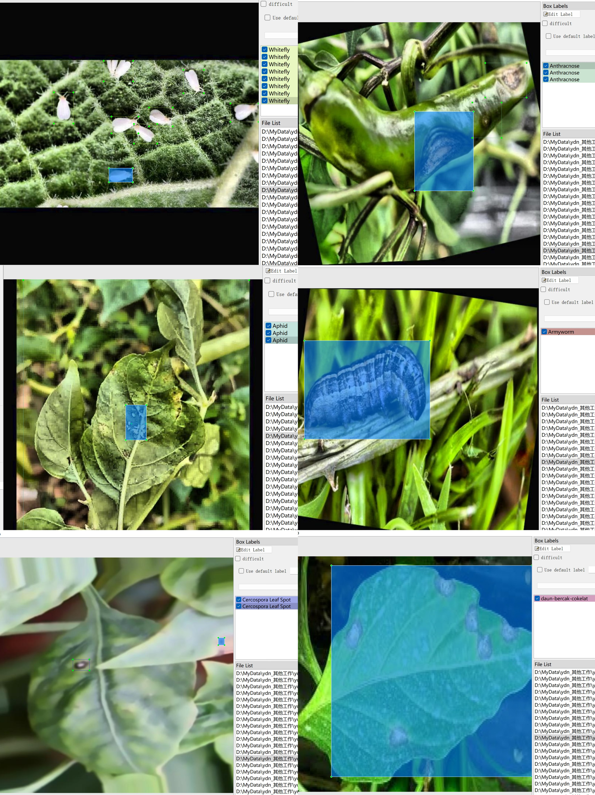
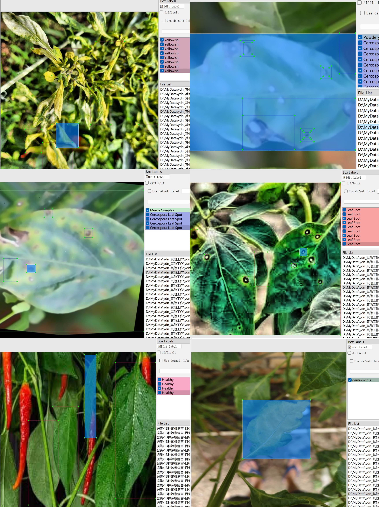

# 13 Species of Pepper Diseases - Target Detection Dataset

Dataset Information: Data Statistics Summary  
==============================================================  
Total Label Count: 13  
Labels List: Anthracnose, Aphid, Armyworm, Cercospora Leaf Spot, daun-bercak-cokelat, gemini-virus, Healthy, Leaf Spot, Murda Complex, Nutritional Deficiency, Powdery Mildew, Whitefly, Yellowish  
Total Boxes Count: 66411  
------------------------------------------------------------  
Detailed Statistics for Each Label:  
Label Anthracnose : 841 images, 3404 boxes
Label Aphid : 202 images, 451 boxes
Label Armyworm : 761 images, 805 boxes
Label Cercospora Leaf Spot : 2397 images, 20762 boxes
Label Healthy : 2288 images, 20750 boxes
Label Leaf Spot : 204 images, 1994 boxes
Label Murda Complex : 61 images, 511 boxes
Label Nutritional Deficiency : 321 images, 2932 boxes
Label Powdery Mildew : 91 images, 809 boxes
Label Whitefly : 723 images, 8100 boxes
Label Yellowish : 651 images, 3665 boxes
Label daun-bercak-cokelat : 516 images, 919 boxes
Label gemini-virus : 722 images, 1309 boxes
Note: One image may contain multiple objects, so the total number of boxes might be greater than the total number of images.  
The complete dataset includes three folders and one txt file:  
all_txt folder and classes.txt: Store yolo format txt annotations, in the same number as images, each annotation file corresponds to one image.  
classes.txt:  
all_xml file: VOC formatted xml annotations.  
The number and images are the same, each annotation file corresponds to one image.  
How to see the standardized file of the VOC format, please search it on your own.
## Images

Here is a pay link on Stripe ( https://buy.stripe.com/3cs8yP7sY87d0vu9AB ). Please contact me lonlonago@foxmail.com after funding $89, and I will send you a complete data files , thank you!

